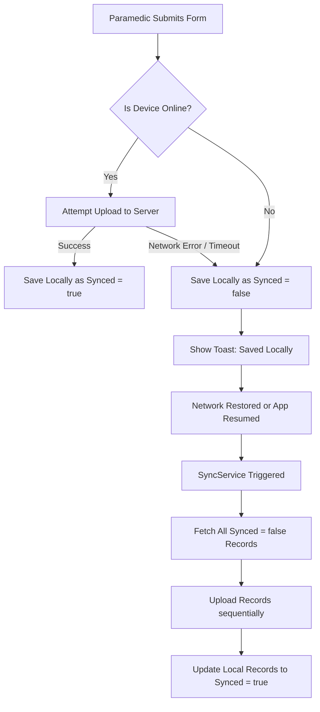

# Medic Triage Intake App

An offline-first emergency medical triage mobile application built with Flutter. Designed for first responders and paramedics to quickly capture patient data in the field, guaranteeing zero data loss even in complete offline scenarios.

---

## 🏗️ Architectural Choices

The codebase is built using a clean, testable, and modular architecture with a **feature-first structure**:

```text
lib/
├── core/
│   ├── constants/       # Global styling & developer configuration (AppTheme)
│   └── services/        # Infrastructure-level singletons (Connectivity, Sync)
└── features/
    ├── authentication/  # Splash screen, initialization flow
    └── triage/          # Core intake form, priority selector, custom widgets
```

### 1. Separation of Concerns & Clean Flow
We enforce a strict unidirectional flow of data:
- **UI (Widgets)**: Purely presentational layer. Calls methods on Providers and listens to rebuild state.
- **Provider (State Management)**: Manages UI loading states, input validation callbacks, and binds services together.
- **Repository Pattern**: Coordinates local caching and remote uploads. The UI only talks to the unified `TriageRepository`, keeping networking details hidden.
- **Hive Database**: High-speed, lightweight key-value database. Ideal for mobile apps due to its small footprint and synchronous read operations.

### 2. Dependency Injection
Dependencies are managed via `Provider` & `MultiProvider` in `app.dart`. This facilitates clean mocking during tests by swapping services at runtime.

---

## 🔄 Offline Synchronization Queue

The application prioritizes local storage to ensure that data is stored immediately and never lost due to networking issues.



### Key Sync Mechanics
- **Unsynchronized Flags**: Records are saved with `TriageStatus.pending`. Upon successful sync, their status changes to `TriageStatus.inTransit`.
- **Automatic Listeners**: `SyncService` listens to connectivity changes using `connectivity_plus`. When connection is restored, it automatically launches the queue sync.
- **Lifecycle Audits**: Whenever the app resumes from the background (`AppLifecycleState.resumed`), a sync check is executed to clear any pending cache.

---

## 🚀 Setup Instructions

### Prerequisites
- Flutter SDK (Latest Stable)
- Android SDK / Xcode (for emulation/testing)

### 1. Get Dependencies
Clone the repository and run:
```bash
flutter pub get
```

### 2. Generate Platform Launcher Icons
To regenerate launcher icons from the core design asset:
```bash
dart run flutter_launcher_icons
```

### 3. Run the App
Launch on your connected device or emulator:
```bash
flutter run
```

---

## 🧪 Verification & Testing

The test suite covers offline submissions, online uploads, and network recovery sync logic using lightweight fake services instead of reflection-based mocks.

Run the test suite using:
```bash
flutter test
```
